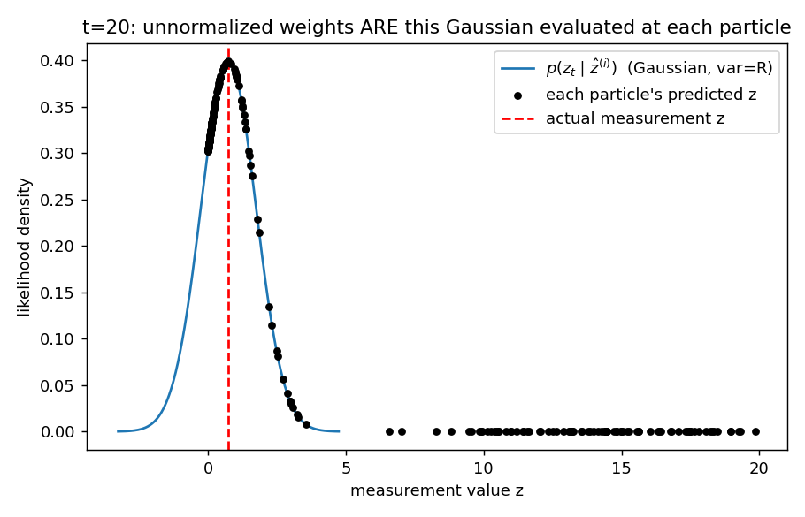
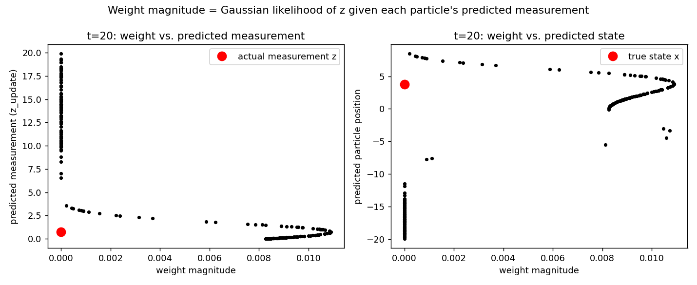
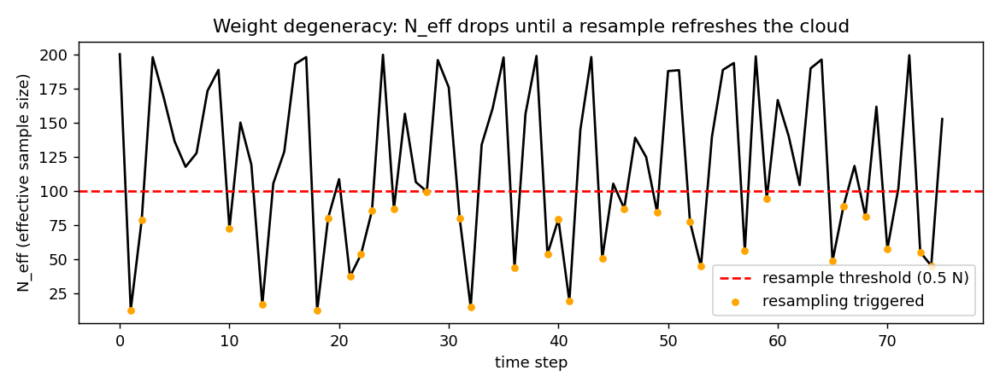
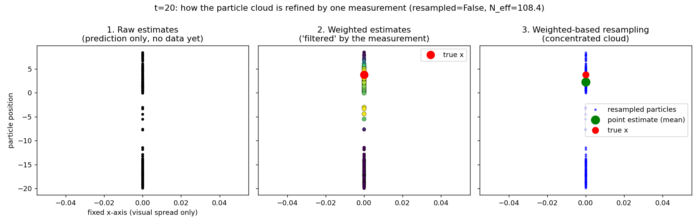

# Particle Filter Tutorial: Tracking a Drifting AUV with a Noisy Acoustic Sensor

This tutorial replaces the original "ninjas chasing a magical quail" story with
a physically grounded scenario that uses **the exact same equations**, so the
code stays a drop-in match for the classic Gordon–Salmond–Smith (1993)
benchmark, but now every term has a real-world meaning.

**The scenario:** An autonomous underwater vehicle (AUV) is drifting in a
tidal current near a research buoy. Its along-track position `x` is affected
by drag, a restoring current eddy, and a periodic tidal push. A hydrophone on
the buoy listens for the AUV's acoustic beacon and estimates the vehicle's
position from the *received signal power*, not from a direct range reading.
Signal power falls off (and reflects off the seabed) in a way that is
proportional to the **square** of position rather than position itself — so
two symmetric positions produce the same reading (the hydrophone cannot tell
"20 m north" from "20 m south"). This sign ambiguity, plus the nonlinear
dynamics, is exactly what makes a Kalman filter struggle and a particle
filter shine.

Files in this tutorial:
- `particle_filter_auv.py` — runnable, documented Python implementation
- `figures/` — pre-rendered plots referenced below (regenerate anytime with `--export-figures`)

---

## 1. The estimation problem, stated precisely

We have a hidden (unobservable) state sequence

x₀, x₁, x₂, …

and a sequence of noisy sensor readings

z₁, z₂, z₃, …

Goal: compute (or approximate)

**P(xₜ | z₁:ₜ)**

"Given every measurement seen so far, what is the full probability
distribution over the vehicle's current position?" Everything below is
machinery for approximating this one object.

---

## 2. The state equation — where it comes from

General form of any motion/process model:

**xₜ = f(xₜ₋₁, t) + wₜ,  wₜ ~ N(0, Q)**

`f` encodes physics (or an empirical stand-in for physics); `wₜ` is
irreducible randomness (turbulence, unmodeled currents, thruster jitter).

For our AUV:

**xₜ = 0.5·xₜ₋₁ + 25·xₜ₋₁ / (1 + xₜ₋₁²) + 8·cos(1.2(t−1)) + wₜ**

Term by term:

| term | meaning |
|---|---|
| `0.5·xₜ₋₁` | linear drag pulling the vehicle back toward the buoy |
| `25·x/(1+x²)` | a nonlinear eddy/restoring current — grows for small `x`, saturates for large `x` because the `1+x²` denominator caps it. This is the source of the nonlinearity a Kalman filter cannot represent exactly. |
| `8·cos(1.2(t−1))` | a periodic tidal forcing term, deterministic and known |
| `wₜ ~ N(0, Q)` | unmodeled turbulence / process noise |

This exact functional form is not "derived" from first principles — it is
the standard nonlinear/non-Gaussian **stress-test model** from Gordon,
Salmond & Smith (1993), reused here because it is a genuinely hard case
(strong nonlinearity + noise) that stands in for real vehicle dynamics. Real
systems build `f` from actual physics instead, e.g.:
- Robot: `xₜ = xₜ₋₁ + vΔt + wₜ`
- Car: `xₜ = xₜ₋₁ + vΔt + ½aΔt² + wₜ`
- Aircraft/AUV: Newton's laws with drag and buoyancy terms

---

## 3. The measurement equation — where it comes from

General form:

**zₜ = h(xₜ) + vₜ,  vₜ ~ N(0, R)**

`h` is dictated by sensor physics, not chosen freely. Examples: GPS gives
`z = x + noise` (linear); radar gives `z = √(x²+y²) + noise`; a camera
projects 3D onto a 2D nonlinear manifold.

For our acoustic sensor, received power/intensity scales with the square of
displacement from the buoy (a stand-in for real acoustic attenuation +
seabed multipath):

**zₜ = xₜ² / 20 + vₜ,  vₜ ~ N(0, R)**

This creates a genuine ambiguity: `x = 10` and `x = −10` both produce
`z = 5`. The hydrophone alone cannot resolve the sign — the filter has to
carry that ambiguity through the particle cloud (you'll see it in the
weight-space plots below) and let dynamics and history resolve it over time.

---

## 4. Bayesian recursion: prediction + update

Suppose at time `t−1` we know `P(xₜ₋₁ | z₁:ₜ₋₁)`.

**Prediction** (push the belief forward through the state equation):

P(xₜ | z₁:ₜ₋₁) = ∫ P(xₜ | xₜ₋₁) · P(xₜ₋₁ | z₁:ₜ₋₁) dxₜ₋₁

**Update** (fold in the new measurement via Bayes' rule):

P(xₜ | z₁:ₜ) = P(zₜ | xₜ) · P(xₜ | z₁:ₜ₋₁) / P(zₜ)

In words: **Posterior = Likelihood × Prediction ÷ Normalizer.**

For a nonlinear `f`/`h` these integrals have no closed form. The particle
filter's entire purpose is to compute this update numerically using samples
instead of algebra.

---

## 5. From Bayes' rule to particle weights (the derivation, step by step)

This is the piece most tutorials skip. Here it is in full.

**Step 1 — represent the prior with particles.** Instead of an equation for
`P(xₜ₋₁ | z₁:ₜ₋₁)`, keep `N` samples `x⁽ⁱ⁾ₜ₋₁` drawn (approximately) from it.

**Step 2 — importance sampling.** We want samples from the posterior
`P(xₜ | z₁:ₜ)` but we can't sample it directly. Importance sampling says:
sample from an easier "proposal" distribution `q`, then correct with a
weight `w = target / proposal`. The simplest, most common choice of proposal
is the **transition prior** itself:

q(xₜ | xₜ₋₁, zₜ) = P(xₜ | xₜ₋₁) = f(xₜ₋₁) + wₜ

i.e. just propagate each particle through the state equation — no measurement
information used yet. This is why "predict" happens *before* "weight."

**Step 3 — the importance weight simplifies beautifully.** With that
proposal choice, the general importance-sampling weight update

wₜ⁽ⁱ⁾ ∝ wₜ₋₁⁽ⁱ⁾ · P(zₜ | xₜ⁽ⁱ⁾) · P(xₜ⁽ⁱ⁾ | xₜ₋₁⁽ⁱ⁾) / q(xₜ⁽ⁱ⁾ | xₜ₋₁⁽ⁱ⁾, zₜ)

collapses (the `P(xₜ|xₜ₋₁)` and `q(...)` terms cancel) to simply:

**wₜ⁽ⁱ⁾ ∝ wₜ₋₁⁽ⁱ⁾ · P(zₜ | xₜ⁽ⁱ⁾)**

and after resampling every step (weights reset to `1/N`), this is just

**wₜ⁽ⁱ⁾ ∝ P(zₜ | xₜ⁽ⁱ⁾)**  — the code's `P_w(i)`.

**Step 4 — plug in the Gaussian measurement-noise model.** Since
`zₜ = h(xₜ) + vₜ` with `vₜ ~ N(0, R)`, we have `zₜ − h(xₜ) ~ N(0, R)`, so

P(zₜ | xₜ) = 1/√(2πR) · exp( −(zₜ − h(xₜ))² / (2R) )

Substituting each particle's predicted measurement `ẑ⁽ⁱ⁾ = h(x⁽ⁱ⁾ₜ)`:

**wᵢ = 1/√(2πR) · exp( −(z − ẑᵢ)² / (2R) )**

This is exactly `P_w(i)` in the MATLAB code and `gaussian_likelihood()` in
the Python port. **The weight literally *is* the Gaussian density function
evaluated at the distance between what the particle predicted and what the
sensor actually reported** — nothing more mysterious than that.

**Step 5 — normalize** so the weights form a valid probability distribution:

wᵢ ← wᵢ / Σⱼ wⱼ,  so that Σᵢ wᵢ = 1

**Step 6 — resample** according to the weights (multinomial or systematic;
see §7) to turn the *weighted* particle set back into an *unweighted* one
that's concentrated where the posterior mass actually is.

**Step 7 — estimate.** The Monte-Carlo estimator of the posterior mean is

x̂ₜ = E[xₜ | z₁:ₜ] ≈ Σᵢ wᵢ · x⁽ⁱ⁾ₜ

(weighted mean, valid *before* resampling); after resampling, all weights
are `1/N` again so `x̂ₜ ≈ (1/N) Σᵢ x⁽ⁱ⁾ₜ` — the plain mean the original
MATLAB code uses. The Python port computes the **weighted mean before
resampling** by default (`--estimate weighted_mean`), which is the
statistically correct estimator and slightly lower-variance than averaging
after resampling, since resampling itself injects extra Monte-Carlo noise.

---

## 6. Understanding "weight magnitude" concretely

A particle's weight is not an arbitrary score — it is literally read off the
Gaussian bump in §5-Step 4, evaluated at that particle's predicted
measurement:



Every black dot is one particle's predicted measurement `ẑ⁽ⁱ⁾`, placed on
the Gaussian curve centered at the *actual* sensor reading `z` (red dashed
line). A particle whose predicted measurement lands near the peak gets a
large weight; one far out in the tail gets a weight near zero. Because
`h(x) = x²/20` is not one-to-one, particles near `+x` and `−x` of the same
magnitude land at the *same* `ẑ`, so they can receive similar weights —
that's the sign ambiguity from §3 showing up directly in weight space:



Left panel: weight vs. each particle's predicted measurement — you can see
the Gaussian bump shape directly, centered on the true `z` (red dot). Right
panel: the same weights plotted against each particle's predicted *state* —
notice weight is not a simple function of `x` because of the squaring in `h`.

---

## 7. Resampling and why the weights need to be "reset"

If we never resampled, weights would keep multiplying together over time
(§5-Step 3, the `wₜ₋₁⁽ⁱ⁾ ·` term) and almost all probability mass would
collapse onto one particle after a few steps — a classic failure mode called
**weight degeneracy**: thousands of particles, but only one carries any
useful information, so the Monte-Carlo estimate becomes high-variance and
unreliable.

We track this quantitatively with the **effective sample size**:

**N_eff = 1 / Σᵢ wᵢ²**

`N_eff = N` when weights are perfectly uniform (no degeneracy); `N_eff → 1`
when one particle owns nearly all the weight. The refined implementation
resamples **adaptively**, only when `N_eff` falls below a threshold
(default: half of `N`), rather than at every single step — this avoids
injecting unnecessary resampling noise when the current particle set is
already healthy:



**Resampling scheme:** the Python port defaults to **systematic
resampling** rather than the naive multinomial (`cumsum` + uniform draw)
scheme from the original MATLAB code. Systematic resampling uses a single
random offset with `N` evenly spaced draws instead of `N` independent random
draws, which provably gives lower-variance resampling for the same `N` —
a small change with a real accuracy payoff (see §9's benchmark).

**Roughening / jitter:** resampling duplicates high-weight particles
exactly, which after many iterations can collapse the cloud onto very few
distinct values (**sample impoverishment**) — especially damaging with
small `N`. The refined code adds a small Gaussian jitter (`--no-roughening`
to disable) to resampled particles, sized relative to the current particle
spread, to keep diversity in the cloud without biasing the estimate.

---

## 8. The plot progression: raw → weighted → resampled

This is the heart of the intuition, and the reason the plot sequence below
is exactly the "before → after" story from the lecture. All three panels use
the *same* particle cloud, just at three different points in the pipeline:



1. **Raw estimates (left).** Straight out of the state equation, before any
   sensor information is applied. This is pure open-loop prediction — the
   cloud simply reflects "where physics + process noise says the vehicle
   could be." Uncertainty only grows here; nothing has "corrected" it yet.

2. **Weighted estimates (middle).** The *same* particle positions, now sized
   and colored by their likelihood weight from §5–§6. This is why we call it
   "filtered": the measurement doesn't move the particles, it re-weights
   them, favoring the ones whose predicted sensor reading matches what was
   actually observed. This is the literal implementation of Bayes' rule —
   multiplying the prediction by the likelihood.

3. **Weighted-based resampling (right).** Drawing a *new* unweighted
   particle set proportionally to those weights. Low-weight particles are
   pruned; high-weight ones are duplicated (with jitter, §7). The green dot
   is the point estimate (weighted mean, §5-Step 7) — notice how much
   tighter this cloud is around the true position (red dot) than panel 1.
   This step exists because carrying weights forward indefinitely causes
   degeneracy (§7); resampling converts "a few particles with big votes"
   back into "many particles with equal votes," ready for the next
   prediction step.

If you look closely at panel 2, the weight distribution across particles
resembles a bell/Gaussian-shaped concentration around the best-matching
particles — a direct visual consequence of the Gaussian likelihood in §6.

---

## 9. Estimation quality: does the refinement actually help?

Head-to-head RMSE (same random seed, same true trajectory) over 75 steps:

| configuration | particles | resampling | estimator | roughening | RMSE |
|---|---|---|---|---|---|
| original MATLAB-style | 10 | multinomial, every step | plain mean | none | **7.26** |
| refined (this repo, default) | 200 | adaptive systematic | weighted mean | on | **3.69** |

Reproduce this comparison:
```bash
python3 - <<'PY'
from particle_filter_auv import ParticleFilterRun
import numpy as np

seed = 7
naive = ParticleFilterRun(N=10, resample_method="multinomial", estimate_method="mean",
                           resample_threshold=1.1, roughening=False, seed=seed).run()
refined = ParticleFilterRun(N=200, resample_method="systematic", estimate_method="weighted_mean",
                             resample_threshold=0.5, roughening=True, seed=seed).run()

rmse = lambda pf: np.sqrt(np.mean((np.array(pf.x_out) - np.array(pf.x_est_out)) ** 2))
print("naive :", rmse(naive))
print("refined:", rmse(refined))
PY
```

What changed, and why each change helps:
- **More particles (10 → 200).** Monte-Carlo error shrinks like `1/√N`; 10
  particles is far too few for a state space this nonlinear.
- **Weighted mean instead of post-resample mean.** Uses the full
  information in the weights instead of throwing it away the instant
  resampling makes weights uniform again.
- **Systematic instead of multinomial resampling.** Lower-variance
  resampling for the same `N` (§7).
- **Adaptive resampling (only when `N_eff` is low).** Avoids adding
  resampling noise on steps where it isn't needed.
- **Roughening/jitter.** Prevents the particle-impoverishment failure mode
  that quietly degrades small-`N` filters over long runs.

---

## 10. Running the code

```bash
# Basic run — prints RMSE, shows the trajectory plot
python3 particle_filter_auv.py

# Movie-like running plot: watch the trajectory and particle cloud update live
python3 particle_filter_auv.py --animate

# Turn on any of the originally-commented-out MATLAB plots individually:
python3 particle_filter_auv.py --show-init-dist         # initial Gaussian particle cloud
python3 particle_filter_auv.py --show-weight-space --step 20
python3 particle_filter_auv.py --show-stage-plots  --step 20   # raw -> weighted -> resampled
python3 particle_filter_auv.py --show-likelihood   --step 20   # explicit Gaussian likelihood curve
python3 particle_filter_auv.py --show-neff                     # degeneracy / N_eff over time
python3 particle_filter_auv.py --show-all                      # everything at once

# Headless export of every figure as PNG (used to build this README)
python3 particle_filter_auv.py --export-figures ./figures

# Tune the filter
python3 particle_filter_auv.py --N 500 --resample systematic --estimate weighted_mean \
                                --resample-threshold 0.5
```

Every flag maps directly to a `%{ ... %}` commented block in the original
MATLAB script — nothing was deleted, it was just turned into an explicit,
independently toggleable option instead of dead code.

### Key parameters
| flag | meaning |
|---|---|
| `--N` | number of particles |
| `--T` | number of time steps |
| `--xN` / `--xR` | process noise variance `Q` / measurement noise variance `R` |
| `--V` | variance of the initial prior around `x0` |
| `--resample {systematic,multinomial}` | resampling scheme (§7) |
| `--estimate {weighted_mean,mean}` | point-estimate formula (§5-Step 7) |
| `--resample-threshold` | resample when `N_eff < threshold · N` (§7) |
| `--no-roughening` | disable post-resample jitter (§7) |
| `--seed` | fix the RNG for reproducible comparisons |
